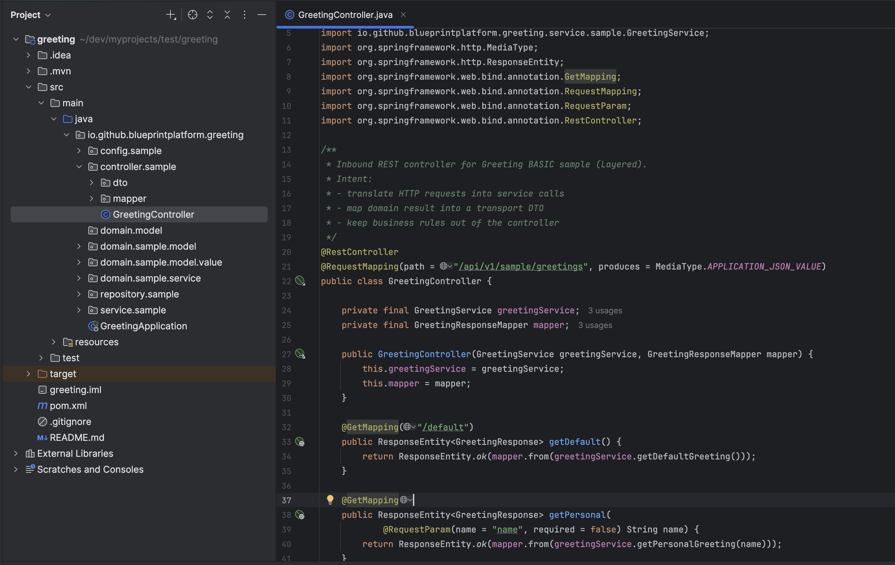

# Codegen Blueprint — Architecture-First Project Generator 🚀

[](https://github.com/blueprint-platform/codegen-blueprint/actions/workflows/build.yml)
[](https://github.com/blueprint-platform/codegen-blueprint/releases/latest)
[](https://github.com/blueprint-platform/codegen-blueprint/actions/workflows/codeql.yml)
[](https://codecov.io/gh/blueprint-platform/codegen-blueprint/tree/main)
[](https://openjdk.org/projects/jdk/21/)
[](https://spring.io/projects/spring-boot)
[](https://maven.apache.org/)
[](LICENSE)

<p align="center">
  
</p>

> **Codegen Blueprint** is for teams who care less about *how fast a project starts*  
> and more about *how well its architecture survives over time*.

---

### 🤔 Should I clone this repository?

Clone this project if you’ve ever seen a codebase start clean and slowly drift into chaos —
where architectural rules exist only in slides, not in code.
**Codegen Blueprint is not a faster way to scaffold a project;**
it is a deliberate way to *lock architectural intent into executable, testable constraints*
from day zero.
If long-term maintainability, domain purity, and enforced boundaries matter to you,
this repo is worth your time.

---

### 🛡 1.0.0 Non-Negotiable Promise

**Every project generated by Codegen Blueprint 1.0.0 ships with enforceable architectural guardrails —**
not documentation, not conventions, but **executable rules that fail your build when architecture drifts**.

## 🧭 Architecture as a Product

Most teams don’t fail because they chose the wrong framework.  
They fail because **architecture slowly drifts once the project is “up and running.”**

What starts as a clean design turns into:
- shortcuts under delivery pressure
- blurred boundaries between layers
- domain logic leaking into frameworks
- “we’ll fix it later” decisions that never get fixed

Traditional project generators help you **start fast** —  
but they disappear the moment the first commit is made.

**Codegen Blueprint exists to solve what happens *after* generation.**

It treats architecture as a **first-class, executable product**:

* Enforces architectural boundaries — layered and/or Hexagonal (opt-in)
* Prevents silent architecture drift
* Protects the domain from frameworks by construction
* Standardizes early decisions across teams — automatically

> **Executable Architecture — Delivered from day zero. Enforced over time.**

<br/>

<p align="center">
  
  <br/>
  <em>Who benefits → Engine capabilities → What teams get</em>
</p>

---

🔗 Part of the **Blueprint Platform**  
https://github.com/blueprint-platform

🤝 [Contributing](#-contributing)

---


### 🎯 Who is this for?

| Role                 | Problem Solved                                |
| -------------------- | --------------------------------------------- |
| Platform Engineering | Org‑wide standardization made enforceable     |
| Lead Architects      | Governance as Code — constraints auto‑applied |
| Developers           | No boilerplate — productivity from day zero   |
| New Team Members     | Architecture learning curve removed           |

---

### 🥇 What makes it different?

> **Initializr-like convenience** → **Architecture-first evolution**

| Capability Focus         | Spring Initializr / JHipster | Codegen Blueprint |
| ------------------------ | ---------------------------- | ----------------- |
| Folder scaffolding       | ✔                            | ✔                 |
| Architecture governance  | ⚠️                           | **✔**             |
| Framework‑free domain    | ❌                            | **✔**             |
| Profile‑driven evolution | ⚠️                           | **✔**             |
| Anti‑drift roadmap       | ❌                            | **✔**             |

---

### 🧩 Generate vs Enforce (Cross‑Cutting Concerns)

Most generators **generate code** for cross‑cutting concerns.
That approach does not scale.

**Codegen Blueprint makes a clear distinction:**

| Approach              | What happens                                               | Long‑term effect                             |
| --------------------- | ---------------------------------------------------------- | -------------------------------------------- |
| Generate code         | Copies security, logging, error handling into each service | ❌ Drift, copy‑paste, painful upgrades        |
| Enforce via libraries | Centralized, versioned, opt‑in behavior                    | **✔ Consistency, easy upgrades, governance** |

> **Not everything should be generated.**
> Cross‑cutting concerns should be **enforced**, not duplicated.

With Blueprint Platform:

* Architecture is generated once
* Behavior is enforced via **shared libraries / BOMs**
* Upgrades happen in **one place**, not 50 microservices

This is why Blueprint is not a template collection.

> **It is architecture as an executable product.**

---

> 🧩 Same simplicity — **better long‑term alignment**

---

## 📑 Table of Contents

* ⚡ [What is Codegen Blueprint (Today)?](#-what-is-codegen-blueprint-today)
* 🧪 [Architecture Enforcement Walkthrough](#-architecture-enforcement-walkthrough)
* 🧭 [1.0.0 Release Scope](#-100-release-scope)
* 🧱 [Architecture Overview](#-architecture-overview)
* 🔌 [Inbound & Outbound Adapters](#-inbound--outbound-adapters)
* 🔄 [CLI Usage](#-cli-usage)
* 🧪 [Testing & CI](#-testing--ci)
* 🚀 [Vision & Roadmap](#-vision--roadmap)
* ⭐ [Support](#-support)
* 🛡 [License](#-license)

---

## ⚡ What is Codegen Blueprint (Today)?

A **CLI-driven**, **profile-based**, **architecture-aware** project generator
that turns architectural decisions into **executable output**.

📌 Current profile: **spring-boot-maven-java**

> Spring Boot 3.5+ · Java 21 · Maven — production-ready baseline

Codegen Blueprint today delivers:

* Deterministic, production-ready project scaffolding
* Clean source layout (main + test) with verified bootstrapping
* **Framework-free domain core by construction**
* Profile-driven architecture selection (standard / hexagonal)
* **Optional architecture enforcement via generated ArchUnit tests**
  *(enabled with `--enforcement basic|strict`)*
* Maven configuration, wrapper, and build baseline
* Application configuration (`application.yml`)
* Optional **Hexagonal teaching sample** (domain + ports + adapters)

> Architecture is not only generated —  
> it can be **verified and enforced as part of the project output**.

---

## 🧪 Architecture Enforcement Walkthrough

This walkthrough demonstrates — in the most concrete and undeniable way — that architecture generated by **Codegen Blueprint** is not cosmetic or advisory, but **actively enforced at build time**.

What follows is not a theory, a diagram, or a convention.
It is **executable architecture** failing fast when a boundary is violated.

---

### 🎯 Purpose

The purpose of this walkthrough is to prove a single claim:

> **Architecture generated by Codegen Blueprint is executable and enforceable — not optional.**

Specifically, it shows that when strict enforcement is enabled, architectural boundaries are:

* encoded as executable rules
* evaluated during the build
* enforced deterministically

No human process is involved.
No runtime behavior is required.
The build itself becomes the enforcer.

---

### 🧠 What This Walkthrough Demonstrates

This walkthrough demonstrates three concrete facts:

1. Codegen Blueprint generates projects with **explicit architectural boundaries**
   (layered or hexagonal, depending on the selected layout).

2. When architectural enforcement is enabled using `--enforcement strict`,
   those boundaries are translated into **generated, executable ArchUnit rules**.

3. When a boundary is violated, the build **fails immediately and deterministically** —
   without starting the application and without manual intervention.

---

### 🚫 What This Is NOT

This walkthrough is intentionally **not**:

* a Spring Boot feature demo
* a tutorial on ArchUnit
* a framework comparison
* a discussion about coding style or best practices
* a runtime behavior demonstration

Nothing is started.
Nothing is deployed.
Nothing runs.

This is purely about **compile-time architectural guarantees**.

---

### ✅ Preconditions

The only assumptions required to follow this walkthrough are:

* Codegen Blueprint **1.0.0 (or later)** is used
* A project is generated via the CLI
* Architecture enforcement is enabled with `--enforcement strict`
* No manual changes are made to the generated enforcement rules

No custom ArchUnit rules are written.
No plugins are added.
Everything shown is **generated output**.

---

## 1️⃣ Baseline — Clean Architecture, Clean Build

We begin with a freshly generated project using **strict architecture enforcement**.

At this point:

* No code has been modified
* No shortcuts have been taken
* All architectural rules are generated by Codegen Blueprint

The generated controller follows the intended layered flow:

* Controller → Application Service → Domain

<p align="center">
  
  <br/>
  <em>Generated controller respecting the layered boundary</em>
</p>

Running the build:

```bash
mvn verify
```

**Result:**

* ✅ Build passes successfully
* ✅ All ArchUnit rules are satisfied
* ✅ Architecture is valid and enforceable

This is the **baseline contract**.

---

## 2️⃣ Intentional Violation — Breaking the Boundary

To prove that the architecture is truly enforced, we now introduce a **deliberate violation**.

The controller is modified to **bypass the application/service layer** and depend directly on a **domain service**.

Important observations:

* The code **compiles**
* The change looks harmless
* A code review might miss it

But architecturally, it is illegal.

<p align="center">
  
  <br/>
  <em>Controller directly depending on a domain service (intentional violation)</em>
</p>

At this moment, nothing has been started.
No runtime behavior has occurred.

Only the dependency direction has changed.

---

## 3️⃣ Result — Build Failure (Fail Fast)

We run the exact same build again:

```bash
mvn verify
```

This time, the build fails immediately.

<p align="center">
  
  <br/>
  <em>ArchUnit failing the build due to an architectural violation</em>
</p>

The failure clearly states:

> **Architecture Violation — controllers must not depend on domain services**

The rule reports:

* Constructor dependency on a domain service
* Field dependency on a domain service
* Method calls into the domain service

And crucially:

* ❌ No application was started
* ❌ No runtime checks were involved
* ❌ No human enforcement existed

The architecture failed **by construction**.

---

### 🧨 Why This Matters

This is the difference between:

* *documented architecture* — which can be ignored
* *executable architecture* — which cannot

With Codegen Blueprint:

* Architecture is generated once
* Guardrails are executable
* Drift is detected immediately

> **If a rule is violated, the build breaks.**

No discussions.<br/>
No conventions.<br/>
No exceptions.

That is what **Architecture as a Product** means in practice.

## 🧱 Architecture Overview

Architecture isn’t only drawn — it executes here ⬇

📌 Want the architectural deep dive?

- 🔒 **Executable Architecture Scope (1.0.0 GA)**  
  Defines what is *strictly enforced today* and output guarantees  
  → [Executable Architecture Scope (1.0.0 GA)](docs/architecture/executable-architecture-scope.md)

---

- 🧭 **How to Explore This Codebase (Hexagonal Guide)**  
  Understand ports/adapters, profiles, boundaries  
  → [Hexagonal Architecture Guide](docs/guides/how-to-explore-hexagonal-architecture.md)

---

- 🧠 **Architecture Governance & AI Collaboration Protocol**  
  Defines *how architectural decisions are made, enforced, and protected* —  
  including **how AI is allowed to participate**  
  → [Architecture Governance & AI Protocol](docs/architecture/architecture-governance-and-ai-protocol.md)

### 🧩 Part of the Blueprint Platform

`codegen-blueprint` is the first foundational module of the **Blueprint Platform** — an architecture‑first project generation ecosystem designed to enable consistent, enforceable, and scalable enterprise development.

Unlike traditional generators that simply scaffold code, Blueprint Platform aims to:

* **Standardize enterprise best practices** through opinionated architecture and code structure
* **Integrate reusable common libraries** that encapsulate cross‑cutting concerns (security, logging, error handling, tracing, OpenAPI clients, etc.)
* **Enforce architectural integrity** using built‑in validation and guardrails (e.g., hexagonal boundaries, naming rules, testable layout)

As the platform evolves, more modules will be introduced to complement `codegen-blueprint` with:

* Ready‑to‑use behavior‑driven libraries
* Consistent and generics‑aware OpenAPI client generation
* Support for multiple frameworks and technology stacks

🔗 Learn more at the [Blueprint Platform GitHub Organization](https://github.com/blueprint-platform)

> This aligns with the upcoming **Vision & Roadmap** section below.


> **Domain stays clean — Ports and adapters connect everything else.**

```
domain       // business logic only
application  // orchestrates ports
adapters     // inbound/outbound driven by use cases
bootstrap    // Spring wiring + config
```

<p align="center">
  
  <br/>
  <em>CLI → Use case layer → Domain → Artifacts → Spring Boot project</em>
</p>

### Guarantees

* **No Spring annotations inside the domain**
* **Hexagonal from day zero — when opted‑in**
* Flexible to evolve with future profiles (CQRS, Layered…)

---

## 🧭 1.0.0 Release Scope

> 📌 `main` branch reflects the upcoming **1.0.0 GA**.

### Included — GA Ready

| Feature                                           | Status |
| ------------------------------------------------- | ------ |
| CLI project generation                            | ✔      |
| Optional Hexagonal structure                      | ✔      |
| Optional architecture enforcement (ArchUnit-based)| ✔      |
| Spring Boot 3.5+ + Java 21 + Maven                | ✔      |
| Main & Test entrypoints                           | ✔      |
| Build + config artifacts                          | ✔      |
| Optional greeting sample                          | ✔      |
| MIT License                                       | ✔      |

---

## 🔌 Inbound & Outbound Adapters

Adapters drive interactions **in** and **out** of the core domain — keeping domain logic isolated and testable.

### Inbound (Delivery) — How requests enter

| Adapter | Status     | Description                                          |
| ------ | ---------- | ---------------------------------------------------- |
| CLI    | ✔ GA Ready | Primary driver to generate services via command-line |
| REST   | 🚧 Planned | Future interactive generation + onboarding UX        |

### Outbound (Artifacts) — What the engine produces

> Architecture enforcement artifacts are generated, not hard-wired

Everything required to **build → run → extend** a real service:

* Maven POM + Wrapper
* Main & Test source structure
* Domain + Application + Adapter layout
* Application configuration (YAML)
* Optional Hexagonal sample slice
* Optional **architecture enforcement tests (ArchUnit)**  
  *(enabled via `--enforcement basic|strict`)*
* README + project documentation
* Filesystem writer for artifact creation

> The domain depends on nothing — adapters depend on the domain.

---


## 🔄 CLI Usage

```bash
java -jar codegen-blueprint-1.0.0.jar \
  --cli springboot \
  --group-id io.github.blueprintplatform \
  --artifact-id greeting \
  --name "Greeting" \
  --description "Greeting sample built with hexagonal architecture" \
  --package-name io.github.blueprintplatform.greeting \
  --layout hexagonal \
  --enforcement basic \
  --sample-code basic \
  --dependency web \
  --dependency data_jpa \
  --dependency actuator \
  --target-dir /path/to/output
```

**Output (simplified)**

```
greeting-service/
 ├── pom.xml
 ├── src/main/java/.../GreetingServiceApplication.java
 ├── src/test/java/.../GreetingServiceApplicationTests.java
 ├── src/main/resources/application.yml
 └── .gitignore
```

> Hexagonal with optional sample = ready‑to‑run REST service

---

## 🧪 Testing & CI

```bash
mvn verify
```

Includes:

* ✔ Unit + integration tests
* ✔ JaCoCo coverage
* ✔ CodeQL security analysis
* ✔ Codecov reporting

---

## 🚀 Vision & Roadmap

> Architecture should **execute**, not merely be drawn.  
> And it should stay enforced — even 6, 12, 24 months later.

### 🌟 The Vision

**Blueprint Platform** =  
🔹 Architecture-as-a-Product  
🔹 Reusable Behavior Libraries  
🔹 Enforced Consistency Across Teams

From Day Zero to Production — architecture remains **intentional**, **testable**, and **aligned**.

---

### 🎯 Roadmap

#### 🔹 Phase 1 — Architecture-First Generation (Today)
* Hexagonal / Layered architecture enforcement (opt-in)
* **Optional architecture enforcement via generated ArchUnit tests**
* Profile-driven CLI generation (Spring Boot · Maven · Java 21)
* Domain purity: **no Spring inside the core**
* End-to-end testable scaffolding

📌 **1.0.0 GA Objective** → Zero-drift architectural foundations

---

#### 🔹 Phase 2 — Reusable Enterprise Behavior (In Progress)
* 🔐 Security defaults (OAuth2 / Keycloak)
* 📡 Resilience / Retries / Standardized error handling
* 🔍 Observability: tracing + logs + metrics — auto-wired
* 🧩 Multi-module enterprise service kits (API + Domain + Infra)
* Generics-aware OpenAPI client generation

📌 Libraries become **switch-on features**, not generated boilerplate

---

#### 🔹 Phase 3 — Ecosystem Expansion (Roadmap)
* Gradle & Kotlin support
* Quarkus + future stack profiles
* Visual UI — configure → generate → download
* Drift detection & auto-remediation (governance at scale)
* Platform telemetry for architecture health

📌 Community-driven priorities →  
🔗 Participate: [Discussions](https://github.com/blueprint-platform/codegen-blueprint/discussions)

---

### 🧩 Why this matters

| Without Blueprint | With Blueprint |
|------------------|----------------|
| Architecture drifts silently | Guardrails keep intent executable |
| Boilerplate everywhere | Cross-cutting concerns via libraries |
| Onboarding takes weeks | Day-zero productivity |
| Standards depend on discipline | Standards enforced by construction |

> 📌 The platform grows → Projects stay clean → Enterprise stays consistent

---

**Blueprint Platform isn’t just code generation —  
it is strategic architectural continuity.**

## 🤝 Contributing

We welcome:

* Architecture improvements
* Stack profiles & adapters
* Template & documentation enhancements

Start here → :
* [Discussions](https://github.com/blueprint-platform/codegen-blueprint/discussions)
* [Issues](https://github.com/blueprint-platform/codegen-blueprint/issues)

---

## ⭐ Support

If this project saves your team time or headaches:
👉 **Please star the repo — it truly helps visibility!**

**Barış Saylı** — Creator & Maintainer

* GitHub — [https://github.com/bsayli](https://github.com/bsayli)
* LinkedIn — [https://www.linkedin.com/in/bsayli](https://www.linkedin.com/in/bsayli)
* Medium — [https://medium.com/@baris.sayli](https://medium.com/@baris.sayli)

---

## 🛡 License

MIT — free for commercial and personal use.
See: [LICENSE](LICENSE)
