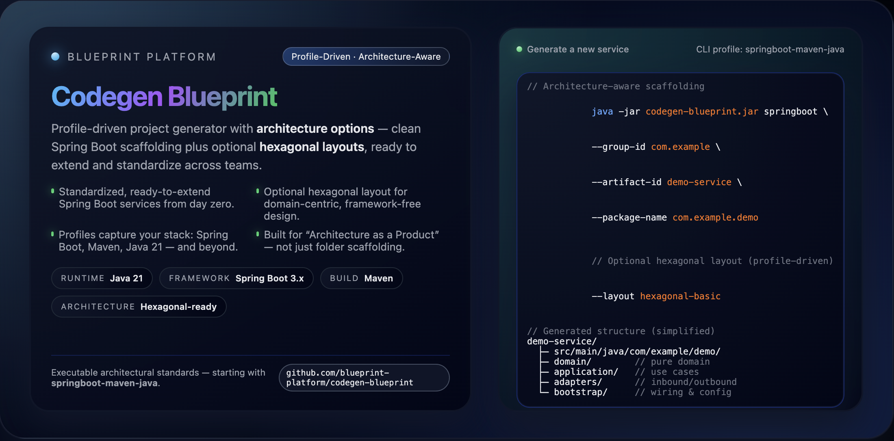
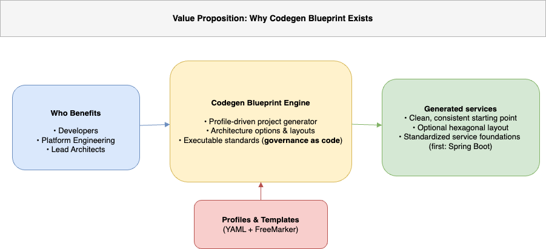
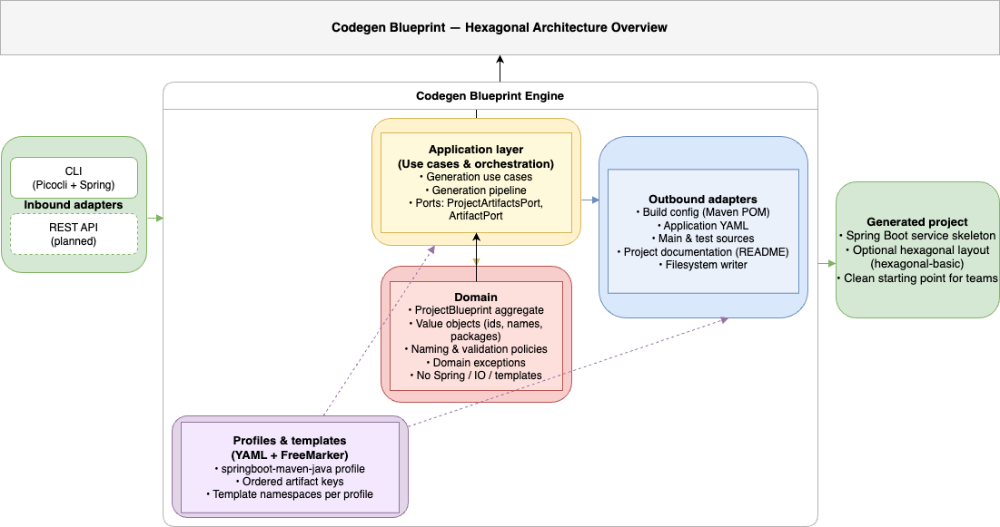

# Codegen Blueprint — Profile‑Driven Project Generator with Architecture Options

[](https://github.com/blueprint-platform/codegen-blueprint/actions/workflows/build.yml)
[](https://github.com/blueprint-platform/codegen-blueprint/releases/latest)
[](https://github.com/blueprint-platform/codegen-blueprint/actions/workflows/codeql.yml)
[](https://codecov.io/gh/blueprint-platform/codegen-blueprint/tree/refactor/hexagonal-architecture)
[](https://openjdk.org/projects/jdk/21/)
[](https://spring.io/projects/spring-boot)
[](https://maven.apache.org/)
[](LICENSE)


<p align="center">
  <span style="font-size: 13px; font-weight: 500; color: #555;">
    Executable Architecture for Every New Service
  </span>
  <br/><br/>
  
</p>

---

## 🧠 Why Codegen Blueprint Exists

Modern engineering teams don’t struggle to **start** new services —  
they struggle to keep them **architecturally consistent** as they scale.

Most generators create a folder layout and walk away.  
Codegen Blueprint enforces **architectural integrity**:

* Starts clean — no framework leaks into the domain
* Stays clean — structure guides every evolution
* Prevents silent architecture drift over time

Not just scaffolding.  
Not just templates.

> **Architecture embedded into the software delivery pipeline.**

<br/>

<p align="center">
  
  <br/>
  <em>Who benefits ➜ What the engine delivers ➜ Generated services</em>
</p>

---

### 🎯 Who is this for?

| Role                 | What you gain                     |
| -------------------- | --------------------------------- |
| Platform Engineering | Organization‑wide standardization |
| Lead Architect       | Governance as Code                |
| Developers           | Clean architecture from day zero  |
| New Team Members     | Instant productivity              |

---

### 🥇 What makes it different?

| Feature                           | Initilizr / JHipster | Codegen Blueprint |
| --------------------------------- | -------------------- | ----------------- |
| Generates folder layout           | ✔                    | ✔                 |
| Enforces architecture correctness | ❌                    | **✔**             |
| Domain remains framework‑free     | ❌                    | **✔**             |
| Profile‑driven evolution          | ⚠️                   | **✔**             |
| Reduces long‑term drift           | ❌                    | **✔**             |

> 🚀 Scaffolding is step 1 — governance is the mission.

---

## 📑 Table of Contents

* ⚡ [What is Codegen Blueprint (Today)?](#-what-is-codegen-blueprint-today)
* 🧭 [1.0.0 Scope & Status](#-100-scope--status)
* 💡 [Why This Project Matters](#-why-this-project-matters)
* 🔌 [Inbound Adapter](#-inbound-adapter-delivery)
* ⚙️ [Outbound Adapters & Artifacts](#-outbound-adapters--artifacts)
* 🧪 [Testing & CI](#-testing--ci)
* 🔄 [CLI Usage Example](#-cli-usage-example)
* 🚀 [Vision & Roadmap](#-vision--roadmap-beyond-100)
* 🤝 [Contributing](#-contributing)
* ⭐ [Support & Community](#-support--community)
* 🛡 [License](#-license)

---

## ⚡ What is Codegen Blueprint (Today)?

A **CLI‑driven**, **architecture‑aware** project generator.

📌 Current primary profile:
**springboot‑maven‑java**
(Spring Boot 3 + Maven + Java 21)

Generates a **clean**, **ready‑to‑extend** Spring Boot project structure — similar to Spring Initializr, but with:

* Clear and predictable layout
* Standardized project metadata (groupId, name, package)
* Built‑in test entry points from day zero
* Consistency without dependency overload

### Optional Architecture Layout

📌 Hexagonal is an evolution path — not a barrier.

For teams embracing Clean/Hexagonal architecture:

```
domain       // business rules (no Spring dependencies)
application  // orchestrates ports
adapters     // inbound & outbound adapters
bootstrap    // Spring wiring & configuration
```

> "Spring Initializr — but **with architecture options built‑in**, not bolted on later."

<br/>

<p align="center">
  
  <br/>
  <em>Inbound adapters ➜ Application layer ➜ Domain ➜ Outbound adapters ➜ Generated project</em>
</p>

---

## 🧭 1.0.0 Scope & Status

### What is included (1.0.0)

| Capability                                    | Status             |
| --------------------------------------------- | ------------------ |
| CLI‑based generation                          | ✔ Production‑ready |
| Standard Spring Boot skeleton                 | ✔ Stable           |
| Optional architecture layout (hexagonal) | ✔ Opt‑in           |
| Spring Boot 3 / Java 21 / Maven support       | ✔                  |
| Generated build + runtime artifacts           | ✔                  |
| Built‑in main + test entrypoints              | ✔                  |
| Open‑source licensing                         | ✔ MIT License      |

### What is planned next

| Feature                                       | Status     |
| --------------------------------------------- | ---------- |
| REST inbound adapter                          | Planned    |
| Advanced hexagonal variations (ports, CQRS)   | Planned    |
| Additional profiles (Gradle, Kotlin, Quarkus) | Planned    |
| Multi‑module generation                       | Planned    |
| Foundation libraries (`blueprint‑*`)          | Planned    |
| Developer UI / web console                    | Evaluating |

> Strategy: **Deep quality for one profile** → expand ecosystem after.

📌 For details, see:
- [Engine Enforcement Scope (1.0.0)](docs/architecture/engine-scope.md)
- [Generated Project Scope (1.0.0)](docs/architecture/project-scope.md)

---

## 💡 Why This Project Matters

Modern services deserve more than a bare `/src/main/java`.

You get:

* ✔ Predictable structure
* ✔ Testability from day zero
* ✔ Architecture as a **standard**, not an afterthought
* ✔ Faster onboarding

You avoid:

* ❌ Copy-paste architecture
* ❌ Every repo looks different
* ❌ Best practices lost over time
* ❌ Silent architecture drift

📘 Explore the architecture:  
👉 [How to Explore This Project (Hexagonal Architecture Guide)](./docs/guides/how-to-explore-hexagonal-architecture.md)

### 🧩 Strategic Impact

Architecture stays **intentional — not accidental**.

Teams benefit from:

* Standardized setup across services
* Clear responsibility boundaries
* Faster developer onboarding
* Future enforcement ready (ArchUnit, boundaries)

Result:
**Every new service starts aligned — and scales without losing its architecture.**

---

## 🔌 Inbound Adapter (Delivery)

| Adapter | Status           |
| ------- | ---------------- |
| CLI     | ✔ Primary driver |
| REST    | Planned          |

---

## ⚙️ Outbound Adapters & Artifacts

Active profile:

```
springboot‑maven‑java
```

Generated artifacts:

| Artifact               | Status |
| ---------------------- | ------ |
| Maven POM              | ✔      |
| Maven Wrapper          | ✔      |
| `.gitignore`           | ✔      |
| Application YAML       | ✔      |
| Main source entrypoint | ✔      |
| Test entrypoint        | ✔      |
| Project documentation  | ✔      |

---

## 🧪 Testing & CI

```bash
mvn verify
```

Includes:

* ✔ Unit + integration tests
* ✔ JaCoCo coverage
* ✔ CodeQL security scan
* ✔ Codecov reporting

---

## 🔄 CLI Usage Example

```bash
java -jar codegen-blueprint-1.0.0.jar \
  --cli \
  springboot \
  --group-id com.acme \
  --artifact-id demo \
  --name "Demo App" \
  --description "Demo application for Acme" \
  --package-name com.acme.demo \
  --layout hexagonal \   // optional architecture flag
  --dependency web \
  --dependency data_jpa \
  --dependency validation
```

**Output (simplified)**

```
demo/
 ├── pom.xml
 ├── src/main/java/com/example/demo/DemoApplication.java
 ├── src/test/java/com/example/demo/DemoApplicationTests.java
 ├── src/main/resources/application.yml
 └── .gitignore
```

---

## 🚀 Vision & Roadmap (Beyond 1.0.0)

> Best practices should **execute**, not just be documented.

Roadmap themes:

* 🧱 Hexagonal evolution kit (ports + adapters + CQRS)
* 📈 Observability acceleration (metrics + tracing defaults)
* 🔐 Enterprise-grade security (OAuth2 / Keycloak)
* 🧩 Multi-module service composition
* 🎯 Broader profile ecosystem (Gradle / Kotlin / Quarkus)
* 💻 Developer UI → configure → generate → download

> **Executable Architecture** for modern service development.

---

## 🤝 Contributing

Discussions:
[https://github.com/blueprint-platform/codegen-blueprint/discussions](https://github.com/blueprint-platform/codegen-blueprint/discussions)

Issues:
[https://github.com/blueprint-platform/codegen-blueprint/issues](https://github.com/blueprint-platform/codegen-blueprint/issues)

---

## ⭐ Support & Community

If Codegen Blueprint helps you:  
👉 Please star the repo — it really matters.

**Barış Saylı**

GitHub — [bsayli](https://github.com/bsayli)  
LinkedIn — [linkedin.com/in/bsayli](https://www.linkedin.com/in/bsayli)  
Medium — [@baris.sayli](https://medium.com/@baris.sayli)

---

## 🛡 License

Licensed under MIT — free for personal and commercial use.
See: [LICENSE](LICENSE)
