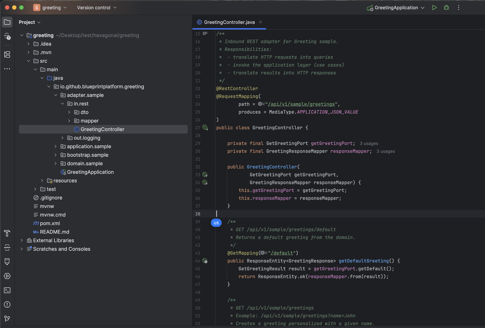
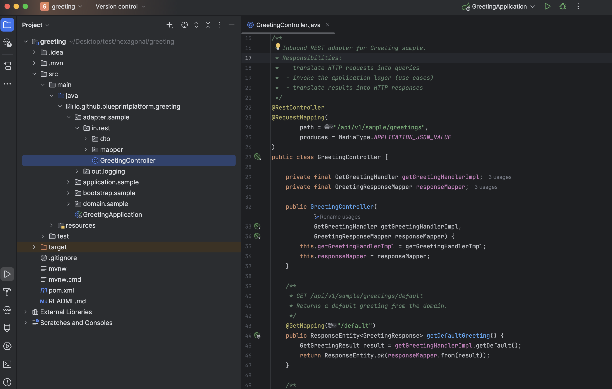
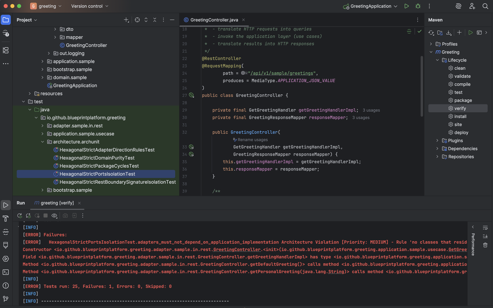
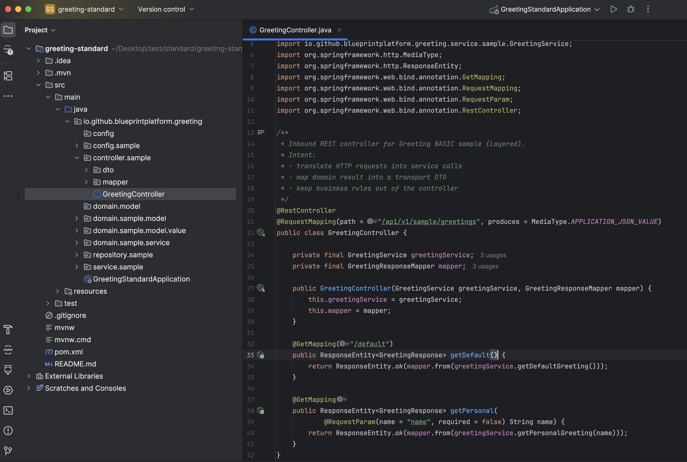
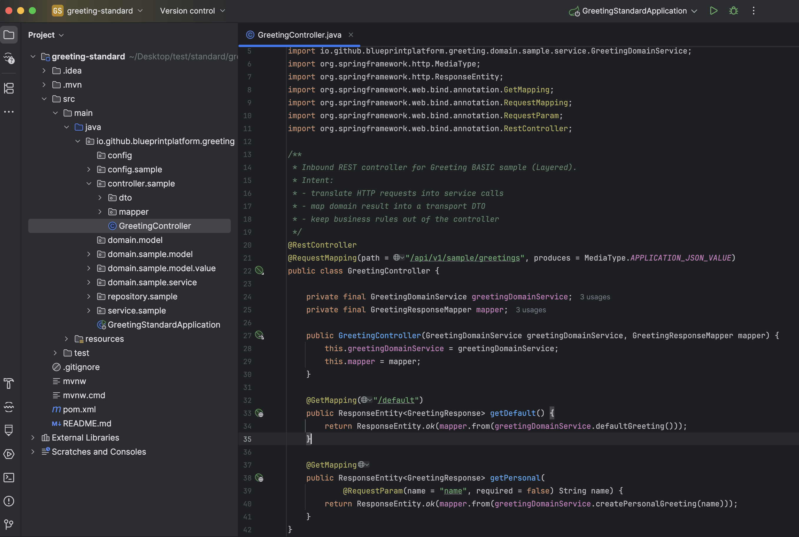
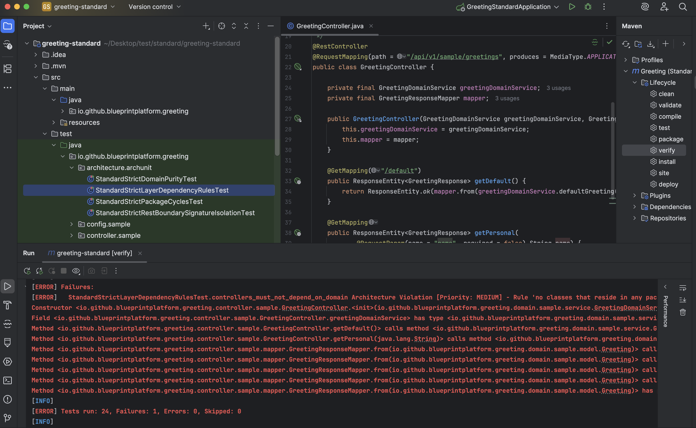

# Executable Architecture Proof — Guardrails Enforcement Walkthrough

## Fast Proof (Console‑First)

If you want to see the **GREEN → RED → GREEN** proof **purely via the console** —
no screenshots, no explanations, just deterministic build output — run:

```bash
# From the repository root
cd docs/demo
chmod +x proof-runner.sh
CODEGEN_JAR=../../target/codegen-blueprint-1.0.0.jar ./proof-runner.sh
```

The command exits with a **non‑zero code on any unexpected behavior** and prints a concise, step‑by‑step status to the console.

---

## What this proves

This single command demonstrates — end to end — that Codegen Blueprint can:

* generate a real project with **strict architecture guardrails**
* evaluate those guardrails **at build time** (`mvn verify`)
* fail the build **deterministically** when a boundary is violated
* return to green immediately once the violation is removed

No app server run.
No runtime checks.
No custom test harness.

> **Architecture is evaluated by the build itself.**

---

## Proof Flow (High‑Level)

The script executes the following sequence for **both Hexagonal and Standard (Layered)** architectures:

```
Generate project
→ mvn verify (GREEN)
→ inject boundary violation
→ mvn verify (RED)
→ revert violation
→ mvn verify (GREEN)
```

This is performed for **real generated code**, not mocks, examples, or pre‑canned test fixtures.

---

## Proof Output (Persistent, Inspectable Artifacts)

In addition to console output, **each run produces a durable proof bundle** under the repository:

```
docs/demo/proof-output/
```

### Per‑run directory structure

Each execution creates a **timestamped run directory**:

```
docs/demo/proof-output/
└── 20260104-180325/
    ├── logs/
    │   ├── HEX_baseline.log
    │   ├── HEX_violation.log
    │   ├── HEX_fixed.log
    │   ├── STD_baseline.log
    │   ├── STD_schema_violation.log
    │   ├── STD_schema_fixed.log
    │   ├── STD_violation.log
    │   └── STD_fixed.log
    ├── excerpts/
    │   ├── HEX_violation.excerpt.txt
    │   ├── STD_schema_violation.excerpt.txt
    │   └── STD_violation.excerpt.txt
    ├── env.txt
    └── proof-summary.txt
```

A convenience pointer is also maintained:

```
docs/demo/proof-output/latest/
```

which always refers to the **most recent run**.

---

## What each artifact means

### `logs/`

* Full, raw build output (`mvn verify`) for each proof step
* Contains complete ArchUnit failure messages and stack traces
* Suitable for deep inspection, CI attachments, or audits

### `excerpts/`

* Focused slices extracted from logs
* Centered around **ArchUnit / guardrails violations**
* Designed for fast human review without scanning full logs

### `env.txt`

Captured execution context, including:

* OS and shell
* Java version
* Maven version
* Codegen Blueprint JAR path
* Timestamp of the run

This ensures the proof is **reproducible and attributable**.

### `proof-summary.txt`

A machine‑readable and human‑readable execution ledger:

* ordered proof steps
* PASS / EXPECTED_FAIL / UNEXPECTED_PASS statuses
* exact log and excerpt file references
* final proof result

This file is the **contractual evidence** that the proof executed as intended.

---

## Why this matters

Console output proves **something happened**.

The `proof-output` directory proves:

* **what** happened
* **where** it failed
* **why** it failed
* **that it recovered deterministically**

This transforms guardrails from:

*"trust me, it works"*

into:

> **inspectable, replayable, build‑time evidence**.

---

## Notes
* Each run is append‑only; older runs are preserved unless manually removed
* For deeper inspection of generated projects, run with:

```bash
KEEP_WORK_DIR=1 ./proof-runner.sh
```

---

> This is not documentation.
> This is not convention.
>
> **This is architecture enforced, evaluated, and proven at build time.**

---

## Why there is a detailed walkthrough below

The remainder of this document is the **high-resolution proof**:

* screenshots of the generated structure
* the exact code change that introduces the violation
* the precise ArchUnit rule that fails
* the build output showing **why** it failed

This is intentional.

> Executable architecture is only convincing when **failure is observable and explainable** —
> not just asserted.

---

> This is not a diagram.
> This is not a convention.
> This is **architecture evaluated at build time**.

---

## Table of Contents

- [Purpose](#purpose)
- [What this is (and is not)](#what-this-is-and-is-not)
- [Preconditions](#preconditions)
- [Part I — Hexagonal Architecture (Ports & Adapters)](#part-i--hexagonal-architecture-ports--adapters)
  - [Generation — Hexagonal + Strict](#1-generation--hexagonal--strict)
  - [Baseline — Clean Hexagonal Flow](#2-baseline--clean-hexagonal-flow)
  - [Intentional Violation — Breaking Hexagonal Isolation](#3-intentional-violation--breaking-hexagonal-isolation)
  - [Result — Hexagonal Build Failure](#4-result--hexagonal-build-failure)
- [Part II — Standard (Layered) Architecture](#part-ii--standard-layered-architecture)
  - [Generation — Standard + Strict](#5-generation--standard--strict)
  - [Baseline — Clean Layered Flow](#6-baseline--clean-layered-flow)
  - [Intentional Violation — Controller → Domain Service Dependency (Illegal)](#7-intentional-violation--controller--domain-service-dependency-illegal)
  - [Result — Standard Build Failure](#8-result--standard-build-failure)
- [What this proves](#what-this-proves)
- [Why this matters](#why-this-matters)

---

## Purpose

This walkthrough proves a single, concrete claim:

> **When strict guardrails mode is enabled, architectural boundaries become executable rules that are evaluated during the build.**

Specifically, it demonstrates that:

1. Codegen Blueprint generates projects with **explicit architectural models** (Hexagonal or Standard / Layered).
2. With `--guardrails strict`, those models are translated into **generated ArchUnit rules**.
3. Any architectural violation causes **`mvn verify` to fail immediately** — without starting the application.

---

## What this is (and is not)

### ✅ This is

* A **build-time architecture proof**
* A demonstration of **guardrails rules produced by the generator**
* A deterministic failure when architectural boundaries are violated
* A comparison across **two different architectural models**

### ❌ This is NOT

* A runtime demo
* A Spring Boot feature showcase
* An ArchUnit tutorial
* A style guide

Nothing is started. Nothing is deployed.

---

## Preconditions

To reproduce this walkthrough, you need:

* **Codegen Blueprint 1.0.0 (or later)**
* A project generated via the **CLI**
* Architecture guardrails enabled in **`strict`** mode
* The generated guardrails rules left **unchanged** (no manual edits)

No application startup, runtime configuration, or external infrastructure is required.  
All validations happen **at build time** via `mvn verify`.

---

# Part I — Hexagonal Architecture (Ports & Adapters)

## 1) Generation — Hexagonal + Strict

The project is generated using the following command:

```bash
java -jar codegen-blueprint-1.0.0.jar \
  --cli springboot \
  --group-id io.github.blueprintplatform \
  --artifact-id greeting \
  --name "Greeting" \
  --description "Greeting sample built with hexagonal architecture" \
  --package-name io.github.blueprintplatform.greeting \
  --layout hexagonal \
  --guardrails strict \
  --sample-code basic \
  --dependency web
```

Strict guardrails mode is enabled from the start.
All architectural rules are **generated from profiles**, not handwritten.

---

## 2) Baseline — Clean Hexagonal Flow

At this point:

* No code has been modified
* No shortcuts exist
* All dependencies follow the intended hexagonal direction

Inbound adapters depend **only on application ports**.

**Adapter → Port → Use Case → Domain**

<p align="center">
  
  <br/>
  <em>Hexagonal controller depending only on an application port</em>
</p>

Run the build:

```bash
mvn verify
```

**Result:**

* ✅ Build passes
* ✅ All ArchUnit rules are satisfied
* ✅ Architecture satisfies the generated guardrails

This establishes the **baseline contract**.

---

## 3) Intentional Violation — Breaking Hexagonal Isolation

To prove that guardrails are **not theoretical**, introduce a deliberate violation.

The controller is modified to depend directly on an **application implementation or domain service**, bypassing the port.

Important observations:

* The code still **compiles**
* The change looks harmless
* A code review could miss it

But architecturally, it is illegal.

<p align="center">
  
  <br/>
  <em>Inbound adapter directly depending on an implementation (violation)</em>
</p>

Nothing is started. No runtime behavior exists.
Only the dependency direction changed.

---

## 4) Result — Hexagonal Build Failure

Run the exact same build again:

```bash
mvn verify
```

The build fails immediately.

<p align="center">
  
  <br/>
  <em>Generated ArchUnit rule failing the build</em>
</p>

Key facts:

* ❌ No application startup
* ❌ No runtime checks
* ❌ No manual enforcement

The architecture failed **by construction**.

---

# Part II — Standard (Layered) Architecture

## 5) Generation — Standard + Strict

A second project is generated using the **standard layered model**:

```bash
java -jar codegen-blueprint-1.0.0.jar \
  --cli springboot \
  --group-id io.github.blueprintplatform \
  --artifact-id greeting-standard \
  --name "Greeting" \
  --description "Greeting sample built with standard layered architecture" \
  --package-name io.github.blueprintplatform.greeting \
  --layout standard \
  --guardrails strict \
  --sample-code basic \
  --dependency web
```

The same guardrails mode is used, but **different architectural rules apply**.

---

## 6) Baseline — Clean Layered Flow

In the standard model:

**Controller → Service → Domain**

Controllers are allowed to depend on services,
but **must never depend directly on domain services**.

<p align="center">
  
  <br/>
  <em>Standard controller respecting layered boundaries</em>
</p>

Run the build:

```bash
mvn verify
```

**Result:**

* ✅ Build passes
* ✅ All layered rules are satisfied
* ✅ Architecture is valid

---

## 7) Intentional Violation — Controller → Domain Service Dependency (Illegal)

Now introduce a deliberate boundary violation by injecting and calling a **domain service**
directly from the controller.

Important observations:

* The code still **compiles**
* The application would **still run**
* The change looks harmless — and reviewers may miss it

But architecturally it is illegal in **strict standard layered guardrails**:

> **Controllers must not depend on domain services.**
>
> Domain models may be used internally (e.g., in mappers),
> but orchestration and behavior must be reached via the service layer.

<p align="center">
  
  <br/>
  <em>Controller directly depending on a domain service (intentional violation)</em>
</p>

---

## 8) Result — Standard Build Failure

Run the build again:

```bash
mvn verify
```

The build fails deterministically.

<p align="center">
  
  <br/>
  <em>Layered architecture violation detected at build time</em>
</p>

---

## What this proves

**Different architectures. Different rules. Same outcome.**

* Hexagonal validates **ports & adapter isolation**
* Standard validates **layered dependency direction**
* Both are evaluated **automatically at build time**
* Both surface **boundary drift** by breaking the build deterministically

No documentation is consulted at evaluation time.  
No conventions are trusted.

---

## Why this matters

This is the practical difference between:

* **Documented architecture** — can be ignored
* **Executable architecture** — cannot be ignored

With Codegen Blueprint:

* Architecture is generated once
* Guardrails are executable
* Drift is detected immediately

> **If a rule is violated, the build fails fast with explicit feedback.**

No assumptions.

No hidden conventions.

No silent drift.

That is **Architecture as a Product** —
observable, repeatable, and evaluated at build time.

---

## Generated Project Output (Reference)

This walkthrough focused on **proving guardrails** — not on showcasing generated artifacts.

If you want to see what **actual projects generated by Codegen Blueprint look like**, including:

* the exact `README.md` files written into generated projects
* how architecture, guardrails, and sample code are explained to developers
* what a team receives *after* generation

see:

→ **Generated Project README Previews**  
[Generated Readmes](./generated-readmes.md)

These READMEs are **real generator output**, not examples.

They represent the **human-facing expression of the same architecture contract**
that is **evaluated and verified** throughout this walkthrough.
