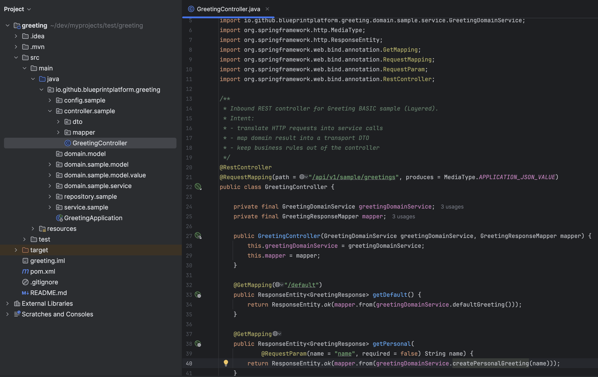
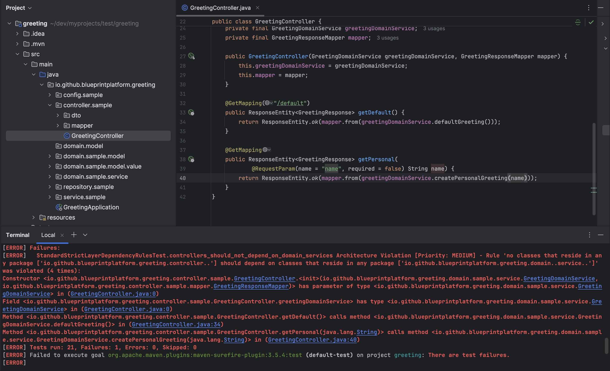

# Executable Architecture Proof — Architecture Enforcement Walkthrough

This document is the **full, step-by-step proof** that Codegen Blueprint can generate **executable architectural guardrails** that **fail the build** when boundaries drift.

> This is not a diagram or a convention.
> It is **architecture enforced at build time**.

---

## Purpose

This walkthrough proves a single claim:

> **When strict enforcement is enabled, architectural boundaries are executable and enforced deterministically during the build.**

Specifically, it demonstrates that:

   1. Codegen Blueprint generates projects with explicit architectural boundaries (standard/layered or hexagonal).<br>
   2. With `--enforcement strict`, those boundaries become **generated ArchUnit rules**.<br>
   3. A violation causes **`mvn verify` to fail** immediately — without starting the application.

---

## What this is (and is not)

### ✅ This is

  * A **build-time** architecture proof
  * A demonstration of **generated** enforcement rules
  * A deterministic failure when dependency direction is violated

### ❌ This is NOT

  * A runtime demo
  * A Spring Boot feature showcase
  * An ArchUnit tutorial
  * A style guide

Nothing is started. Nothing is deployed.

---

## Preconditions

To reproduce this walkthrough, you only need:

  * Codegen Blueprint **1.0.0 (or later)**
  * A project generated via CLI
  * `--enforcement strict` enabled
  * No manual modification of the generated enforcement rules

---

## 1) Baseline — Clean Architecture, Clean Build

Start with a freshly generated project where strict enforcement is enabled.

At this point:

  * No code has been modified
  * No shortcuts exist
  * All rules are generated by Codegen Blueprint

The generated controller follows the intended layered flow:

**Controller → Application Service → Domain**

<p align="center">
  
  <br/>
  <em>Generated controller respecting the layered boundary</em>
</p>

Run the build:

```bash
mvn verify
```

**Result:**

  * ✅ Build passes successfully
  * ✅ All ArchUnit rules are satisfied
  * ✅ Architecture is valid and enforceable

This is the baseline contract.

---

## 2) Intentional Violation — Breaking the Boundary

To prove enforcement is real, introduce a deliberate architectural violation.

Modify the controller to bypass the application/service layer and depend directly on a domain service.

Important observations:

  * The code still **compiles**
  * The change looks harmless
  * A review could miss it

But architecturally it is illegal.

<p align="center">
  
  <br/>
  <em>Controller directly depending on a domain service (intentional violation)</em>
</p>

At this point:

  * Nothing has been started
  * No runtime behavior exists
  * Only the dependency direction changed

---

## 3) Result — Build Failure (Fail Fast)

Run the exact same build again:

```bash
mvn verify
```

Now the build fails immediately.

<p align="center">
  
  <br/>
  <em>ArchUnit failing the build due to an architectural violation</em>
</p>

The failure reports the violation clearly:

  * Constructor dependency on a domain service
  * Field dependency on a domain service
  * Method calls into the domain service

And crucially:

  * ❌ No application was started
  * ❌ No runtime checks were involved
  * ❌ No human enforcement existed

The architecture failed **by construction**.

---

## Why this matters

This is the practical difference between:

  * **Documented architecture** — can be ignored
  * **Executable architecture** — cannot be ignored

With Codegen Blueprint:

  * Architecture is generated once
  * Guardrails are executable
  * Drift is detected immediately

> **If a rule is violated, the build breaks.**

No discussions. No conventions. No exceptions.

That is what **Architecture as a Product** means in practice.
